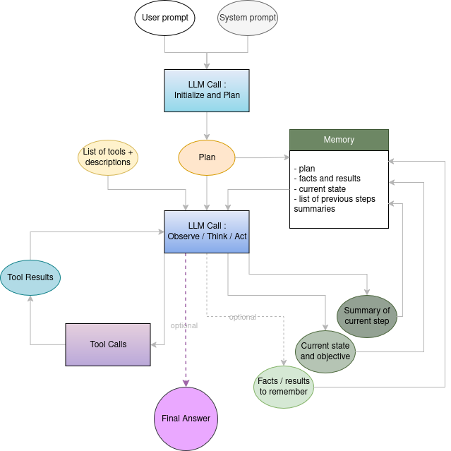

# Agentica

Agentica is a powerful framework for creating, running, and managing large language model (LLM) agents. Built from the ground up with modularity and extensibility in mind, it provides a unified infrastructure that makes it easy to create purpose-driven agents for a wide range of tasks.

## Architecture



The framework features a completely custom-built agent architecture with a structured thought/action/observation loop:

- **Core Agent Framework**: Provides the foundation for all agents with memory management, prompt handling, and tool execution
- **Modular Design**: Each agent is a self-contained module with its own tools, configuration, and purpose
- **Declarative Configuration**: YAML-based configuration makes it easy to adjust agent behavior without code changes
- **Tool System**: Powerful decorator-based system for easily creating tools that agents can use to interact with APIs and services

### Repo structure:
```bash
.
├── agents
│   ├── mail_sorter
│   │   ├── agent.py
│   │   ├── config.yaml
│   │   ├── __init__.py
│   │   ├── test_tools.py
│   │   └── tools.py
│   └── weather_agent
│       ├── agent.py
│       ├── config.yaml
│       └── tools.py
├── auth
│   ├── mail_sorter
│   │   ├── credentials.json
│   │   └── user_credentials.json
│   └── weather_agent
├── core
│   ├── agent.py
│   ├── inference.py
│   ├── __init__.py
│   ├── memory.py
│   ├── prompts
│   │   ├── initialization.yaml
│   │   ├── memory.yaml
│   │   ├── observation.yaml
│   │   ├── specifications.yaml
│   │   └── thinking.yaml
│   ├── tool.py
│   └── utils
│       ├── config.py
│       └── display.py
├── main.py
├── README.md
├── requirements.txt
└── setup.py
```

## Quick video presentation

<iframe width="560" height="315" src="https://www.youtube.com/embed/WVGzbLHz_uI" title="Agentica Presentation" frameborder="0" allow="accelerometer; autoplay; clipboard-write; encrypted-media; gyroscope; picture-in-picture" allowfullscreen></iframe>

## Current Agents

- **Mail Sorter**: Organizes Gmail inbox by intelligently sorting emails into appropriate folders using the Gmail API
- **Weather Agent**: Provides detailed weather information for any location using real-time weather data
- **Internet Researcher**: Performs comprehensive web research on any topic with advanced search and synthesis capabilities

## In Development
- **Code Writer**: Generates, explains, and refines code in various programming languages based on user requirements

## Installation & Setup

1. **Clone the Repo:**
   ```bash
   git clone https://github.com/joey-david/agentica.git
   cd agentica
   ```

2. **Install Dependencies:**
   ```bash
   python3 -m venv .venv
   source .venv/bin/activate
   pip install -r requirements.txt
   ```

3. **Configure as Needed:**  
   Each agent has its own settings file in config.yaml

## Usage

Run the main command-line interface to select and launch agents:

```bash
python main.py
```

Or run a specific agent directly:

```bash
python main.py --agent mail_sorter
```

Each agent will guide you through its capabilities when launched.

## Creating New Agents

Creating a new agent is straightforward:

1. Create a directory in `agents/<your_agent_name>/`
2. Add an agent.py file that defines an Agent object using the `ToolCallingAgent` class
3. Create your agent's tools in a tools.py file using the `@tool` decorator
4. Define your agent's configuration in config.yaml